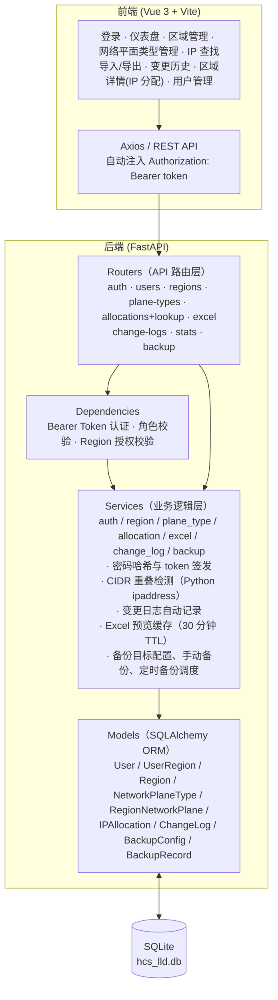
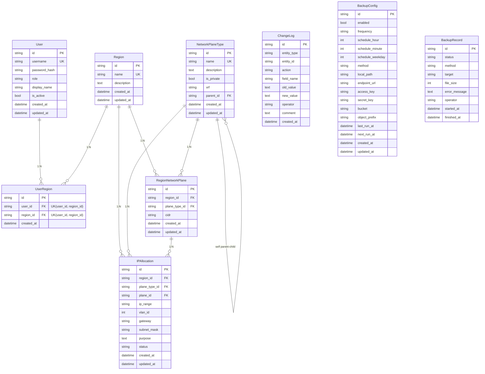
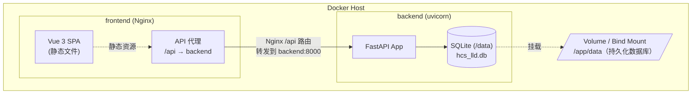
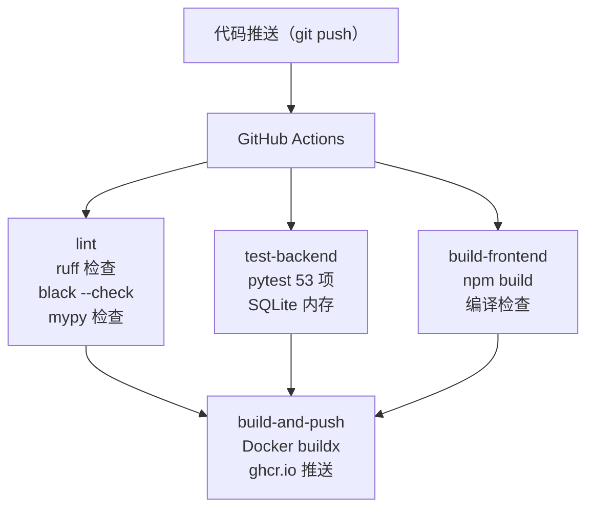

# HCS LLD 管理系统 - 架构设计文档

## 1. 项目背景

HCS（华为云Stack）是企业内部部署的私有云平台。LLD（Low Level Design）是部署 HCS 所需的详细设计文档，通常以 Excel 文件形式记录部署云平台所需的各类网络平面（Network Plane）地址段规划。随着管理的云平台数量增多，传统的本地 Excel 管理方式存在以下问题：

- 多个 Region 的数据分散在多个文件中，难以统一查询
- 无法快速检查某 IP 段是否已被分配
- 数据变更无版本追溯能力
- 多人协作困难

本系统旨在提供一个 Web 管理平台来解决上述问题。

## 2. 核心需求

| 需求 | 说明 |
|---|---|
| Region 管理 | 查询、创建、更新、删除云平台 Region |
| 网络平面自定义 | 可自定义网络平面类型（如管理平面、业务平面、存储平面等），每个 Region 可独立启用/禁用 |
| IP 分配管理 | 管理每个 Region 下各网络平面的 IP 地址段（CIDR），含 VLAN ID、网关、用途、状态等元数据 |
| IP 查重 | 给定 IP 地址或 CIDR 地址段，快速检查是否已被分配，返回所属 Region 和网络平面 |
| Excel 导入 | 按模板格式上传 Excel，支持预览验证后批量导入 |
| Excel 导出 | 按 Region/网络平面过滤导出为 Excel |
| 变更追溯 | 所有数据操作（创建/更新/删除/导入）自动记录变更日志，可查询操作者、时间、变更内容 |
| 数据备份 | 支持配置备份目标，手动立即备份，按每天/每周固定时间自动备份 |
| 认证与权限 | 支持本地账号登录，按 administrator / user 两类角色控制全局配置和 Region 业务数据写权限 |

## 3. 技术选型

| 层级 | 技术 | 版本 | 选型理由 |
|---|---|---|---|
| 后端框架 | Python FastAPI | 0.115+ | 高性能异步框架，自动生成 OpenAPI 文档，Pydantic 校验 |
| ORM | SQLAlchemy | 2.0+ | 成熟可靠，支持迁移工具 Alembic |
| 数据库 | SQLite | 3.x | 零配置，单文件存储，适合 MVP 阶段 |
| 数据库迁移 | Alembic | 1.14+ | SQLAlchemy 官方迁移工具 |
| Excel 处理 | openpyxl | 3.1+ | 纯 Python Excel 读写，无系统依赖 |
| 对象存储 | boto3 | 1.34+ | 支持 S3 兼容对象存储备份 |
| 时区处理 | zoneinfo | Python 内置 | 使用 IANA 时区名解释业务时间 |
| IP 处理 | ipaddress | Python 内置 | 标准库，CIDR 解析与重叠检测 |
| 前端框架 | Vue 3 | 3.5+ | Composition API，体积小，生态丰富 |
| 前端构建 | Vite | 5.4+ | 极速 HMR，开箱即用 |
| UI 组件库 | Element Plus | 2.8+ | 中文友好，表格/表单/对话框组件丰富 |
| 状态管理 | Pinia | 2.2+ | Vue 3 官方推荐状态管理 |
| HTTP 客户端 | Axios | 1.7+ | 拦截器、请求/响应转换 |
| 前后端通信 | RESTful API | - | 简单通用，便于调试 |

## 4. 整体架构



### 4.1 后端分层架构

后端采用经典的三层架构：

1. **Router 层** - API 端点定义，请求参数解析，响应序列化。依赖 `get_db` 获取数据库会话，依赖 `get_current_user` / `require_administrator` / `ensure_region_business_write_allowed` 完成认证与授权。
2. **Service 层** - 核心业务逻辑，包括 CIDR 重叠检测、变更日志记录、Excel 解析验证。Router 层调用 Service 层，Service 层操作 Model 层。
3. **Model 层** - SQLAlchemy ORM 模型，定义数据表结构和关系。通过 Alembic 管理数据库迁移。

### 4.2 前端组件架构

前端采用 Vue 3 Composition API + Vue Router 组织页面：

- **App.vue** - 根组件，仅包含 `<router-view />`
- **AppLayout.vue** - 布局组件，包含侧边栏导航 + 顶栏（面包屑 + 当前用户 + 退出登录）+ 内容区
- **views/** - 页面组件，每个对应一个路由
- **api/** - Axios 请求封装模块，按业务领域拆分
- **stores/** - Pinia 状态管理，存储登录 token、当前用户、Region 授权和侧边栏状态
- **router/** - 路由配置，懒加载页面组件，并通过全局守卫保护登录态与管理员页面

## 5. 数据模型设计

### 5.1 实体关系图



### 5.2 核心表设计

#### users

| 字段 | 类型 | 约束 | 说明 |
|---|---|---|---|
| id | String(36) UUID | PK | UUID v4 |
| username | String(100) | NOT NULL, UNIQUE, INDEX | 登录用户名 |
| password_hash | String(255) | NOT NULL | PBKDF2-HMAC-SHA256 密码哈希 |
| role | String(20) | NOT NULL, INDEX | administrator/user |
| display_name | String(100) | NOT NULL | 页面显示名和审计操作者名 |
| is_active | Boolean | NOT NULL, default=true | 是否允许登录 |
| created_at | DateTime | NOT NULL | 创建时间 |
| updated_at | DateTime | NOT NULL, onupdate | 更新时间 |

本地账号表。系统启动时若 `users` 表为空，会创建一个 bootstrap administrator。

#### user_regions

| 字段 | 类型 | 约束 | 说明 |
|---|---|---|---|
| id | String(36) UUID | PK | UUID v4 |
| user_id | String(36) | FK -> users.id, CASCADE, INDEX | 用户 ID |
| region_id | String(36) | FK -> regions.id, CASCADE, INDEX | 授权管理的 Region |
| created_at | DateTime | NOT NULL | 创建时间 |

约束：`UNIQUE(user_id, region_id)`，防止同一个用户重复绑定同一个 Region。

普通 user 的 Region 授权表。`administrator` 不依赖此表获得权限；普通 user 只能写入被授权 Region 的业务数据。

#### regions

| 字段 | 类型 | 约束 | 说明 |
|---|---|---|---|
| id | String(36) UUID | PK | UUID v4 |
| name | String(100) | NOT NULL, UNIQUE, INDEX | 如 "HCS华北-北京" |
| description | Text | NULLABLE | 自由文本 |
| created_at | DateTime | NOT NULL | 创建时间 |
| updated_at | DateTime | NOT NULL, onupdate | 更新时间 |

#### network_plane_types

| 字段 | 类型 | 约束 | 说明 |
|---|---|---|---|
| id | String(36) UUID | PK | UUID v4 |
| name | String(100) | NOT NULL, UNIQUE, INDEX | 如 "管理平面" |
| description | Text | NULLABLE | 描述 |
| is_private | Boolean | NOT NULL, default=false | 是否私网 |
| vrf | String(100) | NULLABLE | 所属 VRF |
| parent_id | String(36) | FK -> self.id, SET NULL, NULLABLE | 父级网络平面类型；NULL 表示根类型 |
| created_at | DateTime | NOT NULL | 创建时间 |
| updated_at | DateTime | NOT NULL, onupdate | 更新时间 |

全局目录表，所有 Region 共享。网络平面父子层级在此表维护，所有 Region 使用同一棵类型树，最多 3 级嵌套。

#### region_network_planes

| 字段 | 类型 | 约束 | 说明 |
|---|---|---|---|
| id | String(36) UUID | PK | UUID v4 |
| region_id | String(36) | FK -> regions.id, CASCADE | 所属 Region |
| plane_type_id | String(36) | FK -> network_plane_types.id, CASCADE, UNIQUE(region_id, plane_type_id) | 启用的平面类型 |
| cidr | String(43) | NULLABLE | CIDR 地址段，如 "10.0.0.0/22" |
| created_at | DateTime | NOT NULL | 创建时间 |
| updated_at | DateTime | NOT NULL, onupdate | 更新时间 |

Region 维度的网络平面启用和 CIDR 配置表。树形结构由 `network_plane_types.parent_id` 派生；子平面的 CIDR 必须是同 Region 下父级平面 CIDR 的子网段。

#### ip_allocations

| 字段 | 类型 | 约束 | 说明 |
|---|---|---|---|
| id | String(36) UUID | PK | UUID v4 |
| region_id | String(36) | FK -> regions.id, CASCADE, INDEX | 所属 Region（反范式化） |
| plane_type_id | String(36) | FK -> network_plane_types.id, CASCADE, INDEX | 所属网络平面类型 |
| plane_id | String(36) | FK -> region_network_planes.id, CASCADE, INDEX, NULLABLE | 归属的平面节点（精确到树中具体节点） |
| ip_range | String(43) | NOT NULL | CIDR 表示法，如 "10.0.0.0/24" |
| vlan_id | Integer | NULLABLE | VLAN 标识 |
| gateway | String(39) | NULLABLE | 网关地址 |
| subnet_mask | String(15) | NULLABLE | 子网掩码 |
| purpose | Text | NULLABLE | 用途描述 |
| status | String(20) | default='active' | active/reserved/deprecated |
| created_at | DateTime | NOT NULL | 创建时间 |
| updated_at | DateTime | NOT NULL, onupdate | 更新时间 |

**设计决策**：`region_id` 在此表反范式化存储。虽然 `ip_range` 通过 `plane_type_id` 已间接关联 Region，但直接存储 `region_id` 可避免频繁 JOIN，加速 CIDR 查找。`plane_id` 精确关联到 `RegionNetworkPlane` 树中的具体节点，用于平面级 CIDR 范围校验和重叠检测。应用层保证 `(region_id, plane_type_id)` 必须是有效的 `RegionNetworkPlane`。`plane_id` 可空，兼容历史数据。

#### change_logs

| 字段 | 类型 | 约束 | 说明 |
|---|---|---|---|
| id | String(36) UUID | PK | UUID v4 |
| entity_type | String(50) | NOT NULL, INDEX | 实体类型 |
| entity_id | String(36) | NOT NULL, INDEX | 实体 ID |
| action | String(20) | NOT NULL | create/update/delete/import |
| field_name | String(100) | NULLABLE | update 时记录字段名 |
| old_value | Text | NULLABLE | JSON 或纯文本 |
| new_value | Text | NULLABLE | JSON 或纯文本 |
| operator | String(100) | NOT NULL | 操作者 |
| comment | Text | NULLABLE | 备注 |
| created_at | DateTime | NOT NULL, INDEX | 创建时间 |

**设计决策**：显式服务层变更日志记录，而非 SQLAlchemy 事件监听。Service 在每次 mutate 操作后调用 `log_change()`，更可控、可测试。

#### backup_configs

| 字段 | 类型 | 约束 | 说明 |
|---|---|---|---|
| id | String(36) UUID | PK | UUID v4 |
| enabled | Boolean | NOT NULL, default=false | 是否启用定时备份任务 |
| frequency | String(20) | NOT NULL, default='daily' | daily/weekly |
| schedule_hour | Integer | NOT NULL, default=2 | 备份小时，0-23 |
| schedule_minute | Integer | NOT NULL, default=0 | 备份分钟，0-59 |
| schedule_weekday | Integer | NULLABLE | 每周备份的星期，1=周一，7=周日 |
| method | String(30) | NOT NULL, default='local' | local/object_storage |
| local_path | String(500) | NULLABLE | 本地备份目录 |
| endpoint_url | String(500) | NULLABLE | S3 兼容对象存储 Endpoint |
| access_key | String(200) | NULLABLE | 对象存储 AK |
| secret_key | String(500) | NULLABLE | 对象存储 SK |
| bucket | String(200) | NULLABLE | 对象存储 Bucket |
| object_prefix | String(300) | NULLABLE | 对象 Key 前缀 |
| last_run_at | DateTime | NULLABLE | 上次备份完成时间 |
| next_run_at | DateTime | NULLABLE | 下次定时备份时间 |
| created_at | DateTime | NOT NULL | 创建时间 |
| updated_at | DateTime | NOT NULL, onupdate | 更新时间 |

**设计决策**：备份目标配置与定时任务配置存在同一张全局配置表中，但语义上分离。`method/local_path/object_storage` 是手动备份和定时备份共享的备份目标；`enabled/frequency/schedule_*` 只控制自动触发。

#### backup_records

| 字段 | 类型 | 约束 | 说明 |
|---|---|---|---|
| id | String(36) UUID | PK | UUID v4 |
| status | String(20) | NOT NULL | running/success/failed |
| method | String(30) | NOT NULL | 本次执行使用的备份方式 |
| target | String(800) | NULLABLE | 本地文件路径或 s3://bucket/key |
| file_size | Integer | NULLABLE | 备份文件大小（字节） |
| error_message | Text | NULLABLE | 失败原因 |
| operator | String(100) | NOT NULL | 操作者，定时任务为 system |
| started_at | DateTime | NOT NULL | 开始时间 |
| finished_at | DateTime | NULLABLE | 完成时间 |

## 6. API 设计

### 6.1 API 端点总览

| 方法 | 路径 | 说明 |
|---|---|---|
| GET | `/api/health` | 健康检查 |
| POST | `/api/auth/login` | 用户名密码登录，返回 Bearer token |
| GET | `/api/auth/me` | 查询当前登录用户、角色、Region 授权和权限集合 |
| GET/POST | `/api/users` | 用户列表/创建用户（administrator） |
| PUT/DELETE | `/api/users/{id}` | 更新/删除用户（administrator） |
| POST | `/api/users/{id}/reset-password` | 重置用户密码（administrator） |
| GET/POST | `/api/regions` | 列表/创建 Region |
| GET/PUT/DELETE | `/api/regions/{id}` | Region 详情/更新/删除 |
| GET/POST | `/api/regions/{id}/planes` | 启用网络平面类型，返回按全局类型树派生的 Region 平面树 |
| GET/POST | `/api/regions/{region_id}/allocations` | IP 分配列表/创建 |
| GET/PUT/DELETE | `/api/allocations/{id}` | IP 分配详情/更新/删除 |
| GET/POST | `/api/network-plane-types` | 列表/创建网络平面类型，支持维护父级类型 |
| GET/PUT/DELETE | `/api/network-plane-types/{id}` | 类型详情/更新/删除，支持维护父级类型 |
| GET | `/api/lookup?q={ip_or_cidr}&exact=true` | IP/CIDR 查重 |
| GET | `/api/excel/template` | 下载导入模板 |
| POST | `/api/excel/import/preview` | 上传 Excel 预览 |
| POST | `/api/excel/import/confirm` | 确认导入 |
| GET | `/api/excel/export` | 导出 Excel |
| GET | `/api/change-logs` | 变更日志查询 |
| GET | `/api/stats` | 统计数据 |
| GET/PUT | `/api/backup/config` | 查询/更新备份配置 |
| POST | `/api/backup/run` | 立即执行一次备份 |
| GET | `/api/backup/records` | 查询备份执行历史 |

### 6.2 关键接口详情

#### IP 查重 (GET /api/lookup)

查询参数：`q` (IP/CIDR), `exact` (bool)

处理逻辑：
1. 先尝试解析为单 IP（`parse_ip`），若成功则查找包含该 IP 的所有分配
2. 若单 IP 解析失败，尝试解析为 CIDR（`parse_cidr`）
3. `exact=true` 时，CIDR 精确匹配；`exact=false` 时，CIDR 重叠匹配
4. 在 Python 内存中使用 `ipaddress` 模块进行包含/重叠检测（SQLite 无原生 CIDR 类型）

#### Excel 导入（两阶段）

```
第一阶段: POST /api/excel/import/preview
  → 上传 Excel → 解析验证 → 返回预览数据 + preview_id
  → 预览数据在内存缓存 30 分钟

第二阶段: POST /api/excel/import/confirm
  → 传入 preview_id，后端使用当前登录用户作为操作者
  → 批量插入有效行，逐行检查 CIDR 重叠
  → 逐条记录变更日志
```

#### 备份配置与执行

```
GET /api/backup/config
  → 返回全局备份配置；首次访问时创建默认配置

PUT /api/backup/config
  → 更新备份目标和定时任务配置
  → 每天备份需要 schedule_hour + schedule_minute
  → 每周备份需要 schedule_weekday + schedule_hour + schedule_minute
  → 启用定时任务时按固定日程计算 next_run_at

POST /api/backup/run
  → 立即执行一次备份
  → 即使定时任务 disabled，也会使用当前备份目标配置执行
  → 成功或失败都会写入 backup_records

GET /api/backup/records
  → 分页查询备份历史
```

### 6.3 错误处理

所有 API 错误返回一致格式：`{ "detail": "错误描述" }`

| 场景 | HTTP 状态码 |
|---|---|
| 未登录或 token 无效 | 401 |
| 已登录但无权限 | 403 |
| 实体不存在 | 404 |
| 参数校验失败 | 422 |
| 资源冲突（重复名称/重叠 CIDR） | 409 |
| 服务器内部错误 | 500 |

### 6.4 认证与权限

除 `/api/health` 和 `/api/auth/login` 外，业务 API 均要求 `Authorization: Bearer <token>`。后端通过统一依赖解析当前用户，并在 Router 层做角色和 Region 授权校验。

| 角色 | 读权限 | 写权限 |
|---|---|---|
| administrator | 所有业务数据、配置数据、用户数据 | 用户与权限分配、Region 管理、全局配置（网络平面类型、备份配置等） |
| user | 所有业务数据、配置数据 | 仅限已授权 Region 内业务数据（网络平面树、IP 分配、Excel 导入确认） |

权限边界：

1. `administrator` 不写 Region 内业务数据，避免全局管理员直接修改业务规划。
2. `user` 不能管理用户、Region 元数据和全局配置。
3. Excel 导入确认会检查预览数据覆盖的所有 Region，任一 Region 未授权则拒绝导入。
4. 变更日志的 `operator` 来自当前登录用户 `display_name` 或 `username`，不再接受客户端伪造的 `X-Operator`。

### 6.5 启动初始化

应用启动时执行 `ensure_bootstrap_admin()`：当 `users` 表为空时，根据配置创建第一个 `administrator`。相关配置：

| 配置项 | 默认值 | 说明 |
|---|---|---|
| `JWT_SECRET_KEY` | `change-me-in-production` | token 签名密钥，生产环境必须覆盖 |
| `JWT_ACCESS_TOKEN_EXPIRE_MINUTES` | `480` | 访问 token 有效期 |
| `BOOTSTRAP_ADMIN_USERNAME` | `admin` | 初始管理员用户名 |
| `BOOTSTRAP_ADMIN_PASSWORD` | `admin` | 初始管理员密码，生产环境必须覆盖 |
| `BOOTSTRAP_ADMIN_DISPLAY_NAME` | `系统管理员` | 初始管理员显示名 |

## 7. 关键技术决策

### 7.1 反范式化 region_id

**决策**：在 `IPAllocation` 表直接存储 `region_id` 和 `plane_type_id`。

**理由**：标准 CIDR 重叠查询需要 `SELECT * FROM ip_allocations WHERE region_id=? AND plane_type_id=?`，然后在 Python 中进行重叠过滤。直接存储 Region 引用避免了 JOIN 操作。MVP 数据量（< 1000 条）下 Python 端重叠过滤性能足够。

### 7.2 Python 端 CIDR 重叠检测

**决策**：使用 Python `ipaddress` 标准库进行 CIDR 解析和重叠检测，而非编写原始 SQL。

**理由**：SQLite 无原生 CIDR 数据类型。`ipaddress.IPv4Network.overlaps()` 提供了正确的语义。MVP 数据量下内存扫描性能绰绰有余。

### 7.3 全局网络平面类型树

**决策**：网络平面的父子层级只维护在 `network_plane_types.parent_id`，所有 Region 共享同一棵类型树。`region_network_planes` 只表示某个 Region 启用了哪个类型，以及该 Region 下该类型对应的 CIDR。

**理由**：网络平面类型之间的嵌套关系是长期全局规则，不随 Region 改变。把层级放在类型表中，可避免不同 Region 维护出不一致的父子结构；Region 详情页只负责启用全局类型树中的节点。

**核心约束**：

1. 启用子类型平面时，父级类型必须已在同一 Region 启用。
2. 子类型平面的 CIDR 必须落在父级平面的 CIDR 范围内。
3. 同一父级下已启用的兄弟类型平面 CIDR 不能互相重叠。
4. 删除某个 Region 下的父平面时，递归删除该 Region 下已启用的所有子类型平面及其 IP 分配。
5. `region_network_planes` 使用 `UNIQUE(region_id, plane_type_id)` 防止同一 Region 重复启用同一个网络平面类型。

**前端交互**：网络平面类型页面提供“父级平面”选择，用于维护全局类型树；
### 7.4 服务层变更日志

**决策**：Service 层显式调用 `log_change()`，而非 SQLAlchemy 事件监听器。

**理由**：事件监听器需要额外的 `session.info` 传递操作者上下文，且隐含行为难以调试。Service 层方式是显式的、可单元测试的。

### 7.5 UUID 主键

**决策**：所有表使用 UUID v4 主键，存储为 `String(36)`。

**理由**：UUID 防止 ID 枚举攻击，便于未来数据迁移/合并（分布式无冲突）。字符串格式在 API 响应和日志中可读性好。

### 7.6 两阶段 Excel 导入

**决策**：预览（解析验证）→ 确认（批量写入）两阶段。

**理由**：预览步骤让用户在提交前检查解析结果和验证错误。确认时只需传入 preview_id，避免大数据量重新传输。预览缓存 30 分钟防止内存无限增长。

### 7.7 前端本地状态管理

**决策**：每个页面独立 fetch 数据，Pinia 仅存储会话状态（token、当前用户、权限/Region 授权）和少量 UI 状态（侧边栏状态）。

**理由**：共享实体状态引入一致性挑战（跨页面数据同步），没有 WebSocket 难以保持同步。独立 fetch 更简单、正确。

### 7.8 数据库备份机制

**决策**：使用 `backup_configs` 保存全局备份配置，使用 `backup_records` 记录每次执行结果。FastAPI lifespan 启动轻量后台线程 `BackupScheduler`，按固定间隔检查 `next_run_at` 是否到期。

**执行逻辑**：

1. 应用启动时创建表并启动后台调度器
2. 调度器定期读取全局配置，未启用时跳过
3. 当前时间到达 `next_run_at` 时调用 `run_backup()`
4. 备份完成后按 `frequency + schedule_*` 重新计算下一次执行时间
5. 手动备份复用同一个 `run_backup()`，但不依赖 `enabled`

**备份文件生成**：当前数据库为 SQLite，服务从 SQLAlchemy Session 获取底层 SQLite 连接，通过 `iterdump()` 导出 SQL，再写入新的 `.sqlite` 文件。文件命名格式为 `hcs_lld_data_backup_YYYYMMDDHHMMSS.sqlite`。

**备份目标**：

- local：文件直接保存到 `local_path`
- object_storage：先生成临时文件，再通过 boto3 上传到 S3 兼容对象存储，目标为 `s3://{bucket}/{object_prefix}/{filename}`

**限制**：当前实现只支持 SQLite 数据库备份；若未来切换 PostgreSQL/MySQL，需要替换备份生成策略（如 pg_dump/mysqldump 或数据库原生快照）。

### 7.9 时间与时区策略

**决策**：业务时间统一按 UTC 存储和传输，用户配置的定时备份时分按系统业务时区解释。默认业务时区为 `Asia/Shanghai`，通过 `APP_TIMEZONE` 配置。

**具体约定**：

1. Python 内部计算使用 timezone-aware UTC datetime
2. SQLite `DateTime` 字段保存 naive UTC datetime，读取后统一按 UTC 解释
3. API 返回带 `+00:00` 的 ISO 8601 字符串
4. 前端展示统一按 `Asia/Shanghai` 格式化
5. 定时备份的 `schedule_hour/schedule_minute/schedule_weekday` 按 `APP_TIMEZONE` 解释，再转换为 UTC `next_run_at` 保存

**理由**：UTC 存储避免服务器本地时区变化导致排序、过滤和调度判断漂移；业务时区解释定时任务，符合用户对“每天 02:30 / 每周一 02:30”的直觉。

### 7.10 认证鉴权机制

**决策**：采用本地账号 + Bearer token + 两级角色模型。密码使用 PBKDF2-HMAC-SHA256 加盐哈希存储；token 使用 HS256 签名并携带用户 ID、用户名、角色、签发时间和过期时间。

**角色模型**：

1. `administrator` 管理账号、Region 元数据和全局配置，但不能写 Region 内业务数据。
2. `user` 可以读取所有数据，只能写自己被授权 Region 内的网络平面树、IP 分配和导入数据。

**理由**：当前系统是内部部署的管理工具，暂不引入 SSO/OIDC 可降低部署复杂度；两类角色与 TODO 中的权限边界一致。Region 授权单独建 `user_regions` 表，既能表达普通 user 的业务归属，也避免把权限规则散落在前端。

**审计策略**：变更日志仍由 Service 层显式写入，但 `operator` 由 Router 层从当前登录用户解析得到，前端不再传递操作者字段。

## 8. 前端路由设计

| 路径 | 页面组件 | 说明 |
|---|---|---|
| `/login` | Login.vue | 登录页 |
| `/dashboard` | Dashboard.vue | 统计概览仪表盘 |
| `/regions` | Regions.vue | 区域列表 CRUD |
| `/regions/:id` | RegionDetail.vue | 区域详情 + 启用全局网络平面类型 + IP 分配 CRUD |
| `/plane-types` | PlaneTypes.vue | 网络平面类型 CRUD，维护全局父子层级 |
| `/lookup` | Lookup.vue | IP/CIDR 查重搜索 |
| `/import-export` | ImportExport.vue | Excel 导入/导出（Tab 页切换） |
| `/change-logs` | ChangeLogs.vue | 变更历史筛选查询 |
| `/backup-config` | BackupConfig.vue | 备份目标、定时任务、备份历史 |
| `/users` | Users.vue | 用户、角色和 Region 授权管理（administrator） |

路由守卫规则：

1. `/login` 为公开路由；已登录访问登录页会跳转到目标页或仪表盘。
2. 其他路由必须已登录；未登录跳转 `/login?redirect=...`。
3. `meta.adminOnly` 页面仅 `administrator` 可访问。

## 9. 部署说明

### 环境要求

- 开发环境：Python >= 3.12, Node.js >= 18
- Docker 部署：Docker >= 24.0, Docker Compose >= 2.0

### Docker 部署架构



### Docker 部署

#### 方式一：Docker Compose（一键部署）

```bash
docker compose up -d
docker compose logs -f
```

各服务配置：

```yaml
services:
  backend:
    build: ./backend
    ports: ["8000:8000"]
    environment:
      - DATABASE_URL=sqlite:////app/data/hcs_lld.db
      - JWT_SECRET_KEY=please-change-me
      - BOOTSTRAP_ADMIN_USERNAME=admin
      - BOOTSTRAP_ADMIN_PASSWORD=please-change-me
    volumes:
      - hcs-lld-data:/app/data    # 数据库持久化
    healthcheck:
      test: curl http://localhost:8000/api/health

  frontend:
    build:
      context: ./frontend
      args:
        - VITE_API_BASE_URL=/api  # 构建时 API 路径
    ports: ["80:80"]
    environment:
      - BACKEND_URL=http://backend:8000  # 运行时后端地址
    depends_on:
      backend:
        condition: service_healthy
```

#### 方式二：分别构建部署

```bash
# 后端
docker build -t hcs-lld-backend -f backend/Dockerfile backend/
docker run -d --name hcs-lld-backend -p 8000:8000 \
  -e JWT_SECRET_KEY=please-change-me \
  -e BOOTSTRAP_ADMIN_PASSWORD=please-change-me \
  -v hcs-lld-data:/app/data hcs-lld-backend

# 前端
docker build -t hcs-lld-frontend \
  --build-arg VITE_API_BASE_URL=/api \
  -f frontend/Dockerfile frontend/
docker run -d --name hcs-lld-frontend -p 80:80 \
  -e BACKEND_URL=http://你的后端IP:8000 hcs-lld-frontend
```

### Docker 设计要点

1. **多阶段构建**：builder 阶段安装依赖和编译，runtime 阶段仅包含运行所需，减小镜像体积
2. **数据库持久化**：后端通过 `DATABASE_URL` 将数据库路径指向 `/app/data/`，通过 Docker volume 或 bind mount 持久化
3. **前端代理**：Nginx 在容器启动时通过 `BACKEND_URL` 环境变量（envsubst）配置后端代理地址，支持运行时配置无需重新构建
4. **健康检查**：后端配置 `HEALTHCHECK` 确保服务可用后才接受流量
5. **构建缓存**：`requirements.txt` 和 `package.json` 在源码之前复制，利用 Docker 层缓存加速重复构建
6. **启动管理员**：首次启动且 `users` 表为空时，后端会按 `BOOTSTRAP_ADMIN_*` 创建初始 administrator；生产环境必须覆盖默认密码和 `JWT_SECRET_KEY`

## 10. CI/CD 设计

### 10.1 流水线架构



### 10.2 触发规则

| 事件 | 触发行为 |
|---|---|
| PR 提交/更新到 `main` | `lint` + `test-backend` + `build-frontend`（验证不推送） |
| 推送 `main` 分支 | 全部测试 + Docker 构建并推送 latest + SHA 标签 |
| 推送 `v*` 标签 | 全部测试 + Docker 构建并推送 version + latest + SHA 标签 |

### 10.3 工作流定义

四个 Job 按需串联：

1. **lint** — ruff 检查 + black --check + mypy 类型检查
   - pip 缓存加速重复运行
   - mypy 非阻断（允许类型问题但不阻断流程）

2. **test-backend** — Python 3.12, 安装依赖后执行 `pytest tests/ -v`
   - pip 缓存加速重复运行
   - 每个测试用例独立内存 SQLite 数据库，互不干扰

3. **build-frontend** — Node 20, `npm install && npm run build`
   - 仅验证编译是否通过
   - MVP 阶段前端逻辑简单，不编写单元测试

4. **build-and-push** — 依赖 lint + test-backend + build-frontend 三个 Job 成功
   - 使用 Docker Buildx 构建多平台兼容镜像
   - 登录 ghcr.io（使用 GITHUB_TOKEN，无需额外 secrets）
   - Matrix 策略并行构建 backend 和 frontend 镜像
   - 镜像缓存（GitHub Actions Cache）加速重复构建

### 10.4 镜像标签策略

| 标签 | 生成条件 | 示例 |
|---|---|---|
| `latest` | 推送 main 分支时 | `ghcr.io/owner/hcs-lld-backend:latest` |
| `sha-{short}` | 推送 main 分支时 | `ghcr.io/owner/hcs-lld-backend:sha-a1b2c3d` |
| `{version}` | 推送 v* 标签时 | `ghcr.io/owner/hcs-lld-backend:1.0.0` |

### 10.5 测试策略

- **数据库隔离**：每个测试用例使用独立的内存 SQLite（`sqlite://` + `StaticPool`），`Base.metadata.create_all()` 在每个 fixture 中独立建表，互不污染
- **依赖注入覆盖**：通过 `app.dependency_overrides[get_db]` 将数据库会话替换为测试用内存数据库会话
- **无 E2E 测试**：MVP 阶段只做后端 API 测试 + 前端 build 验证。E2E 测试维护成本高于当前收益

### 10.6 关键决策

1. **GITHUB_TOKEN 无需额外配置**：GitHub Actions 内置 token 自动有权限推送 ghcr.io 至当前仓库
2. **Matrix 构建**：backend 和 frontend 使用同一 workflow 的 matrix 策略并行构建，减少 CI 总耗时
3. **Docker 层缓存**：使用 `type=gha` 缓存模式，利用 GitHub Actions Cache 加速镜像构建
